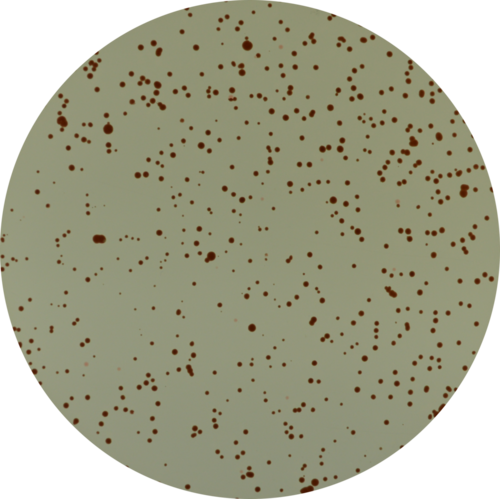

# Cerebro: Spontaneous Mutant Finder

This software was conceived to find and count spontaneous mutants of _Halobacterium salinarum_ NRC-1 when grown on solid media. For that, it will used pre-processed photographies of plated colonies and apply a pattern recognition approach to define which of them are mutants.  
  
On the image below you will see an example. The left photography shows the pre-processed image (input), and the right one shows the image after being processed. The program circulated all valid colonies (satisfying parameters), giving the green color for normal ones and red color for mutants.  


## Usage

```
Rscript cerebro.R <imageInputDir> <imageOutputDir> <resultsDir> <area> <circularity> <eccentricity>

imageInputDir [VARCHAR]:   input directory. this directory must contain raw images with ".tif" extension

imageOutputDir [VARCHAR]:  output directory for processed images. it will be created, so this
                           this directory can not exist before running this script

resultsDir [VARCHAR]:      output directory for results. it will be created, so this
                           this directory can not exist before running this script

area [INT]:                a colony must have an area of at least <area> pixels to be considered
                           a valid colony

circularity [FLOAT]:       a colony must have a circularity of at least <circularity> to be considered
                           a valid colony. circularity is given by (area/perimeter^2) * 4 * pi

eccentricity [FLOAT]:      a colony must have an elliptical eccentricity of <eccentricity> to be considered
                           a valid colony. eccentricity is computed by EBImage::computeFeatures.moment, and
                           given by sqrt(1-(minorAxis^2/majorAxis^2)), according to
                           https://earlglynn.github.io/RNotes/package/EBImage/Features-Moment.html
```

e.g.:

```
Rscript cerebro.R images processedImages results 100 0.8 0.5
```

## Requirements

* R packages: __EBImage (BioConductor)__ and __ggplot2 (CRAN)__. You have to install the R packages before running the script. Some of them might rely on external libraries. It's the case of Fast Fourier Transforms required by EBImage (it installs fftwtools which relies on libfftw3-dev on Ubuntu), so you gotta make everything work first.  

* A directory with the set of photographies to be analyzed (imageInputDir). A big set of images is recommended Images must have ".tif" extension. See example of image below and note that there are two classes of colonies: i. the darker ones (normal colonies); and ii. the lighter ones (mutants).



## Software Name

Yes, Charles Xavier's machine indeed.  
